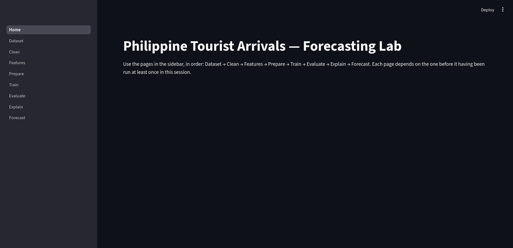
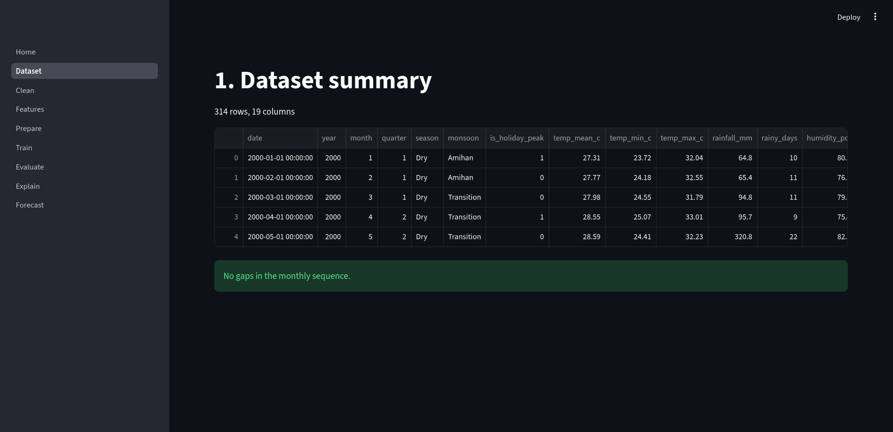
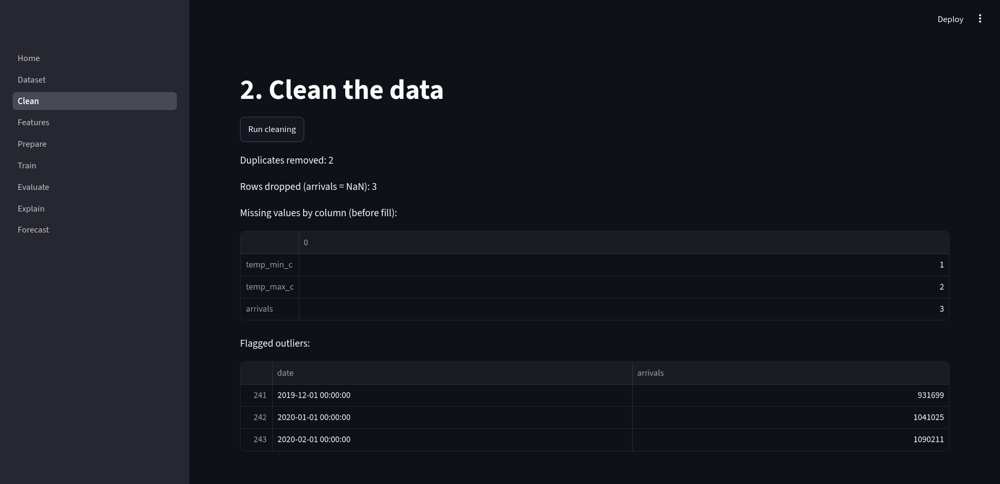
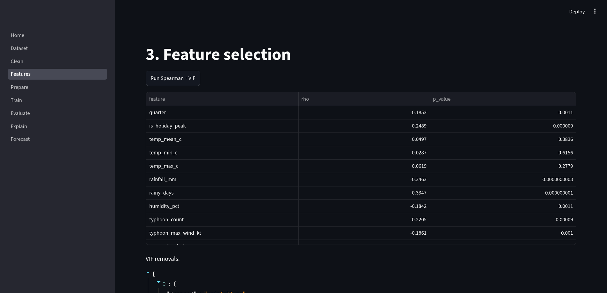
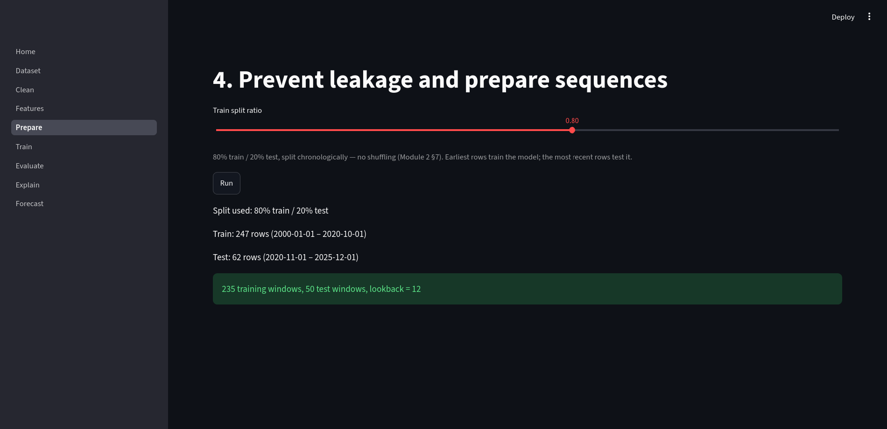
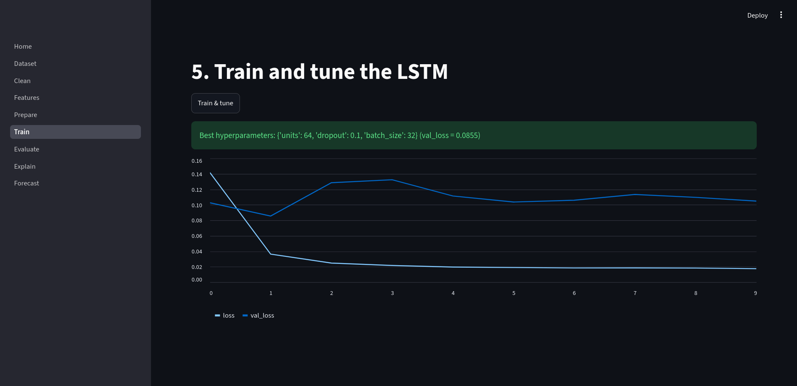
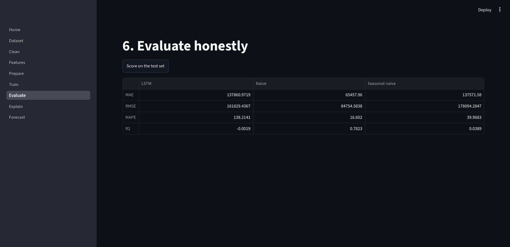
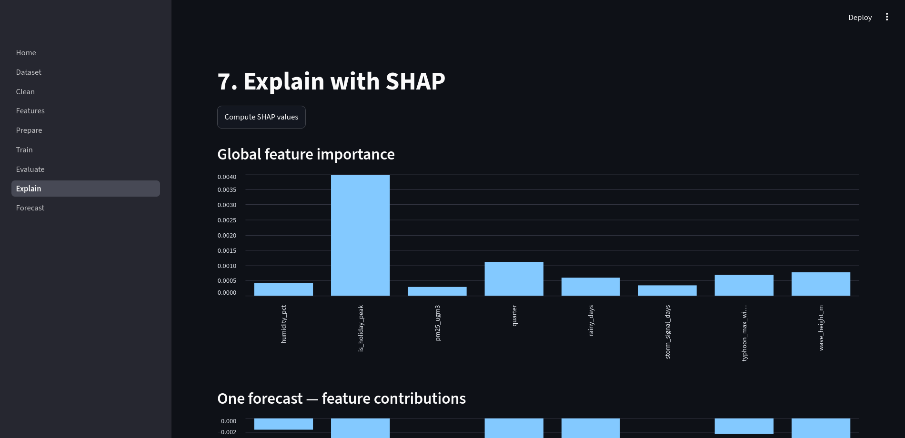
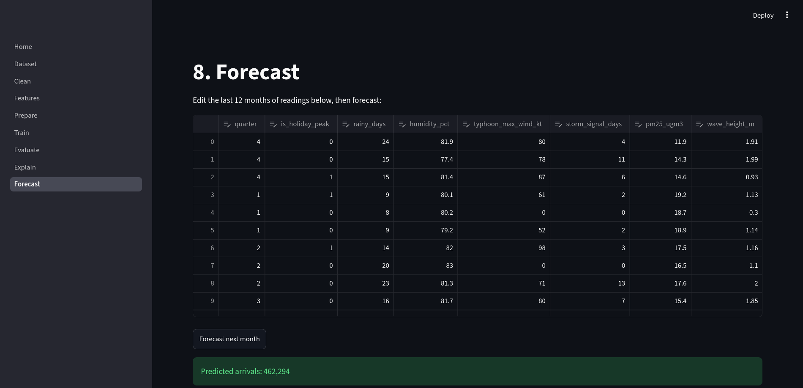

# ITD105 Case Study: Philippine Tourist Arrivals Forecasting

## Summary of the Activity
This project is an end-to-end machine learning pipeline built as a multi-page **Streamlit** web application. It processes historical Philippine tourist arrival data alongside climate and hazard predictors. The pipeline encompasses data cleaning, feature selection (using Spearman correlation and Variance Inflation Factor), leakage-safe sequence windowing, training and tuning an **LSTM (Long Short-Term Memory)** neural network, evaluating performance against baseline models, and explaining the model's behavior using **SHAP** (Explainable AI). 

## What the App Wants to Find Out
The primary goal of this application is to **forecast the total number of monthly tourist arrivals to the Philippines** using historical data and environmental predictors (like temperature, rainfall, typhoons, and air quality). 

Beyond just providing a prediction, the app aims to answer *why* the model makes its decisions. By using SHAP, the application identifies which environmental features are the strongest drivers of tourist arrivals and how specific factors (e.g., a typhoon or heavy rainfall) positively or negatively impact the forecast for a given month.

## Screenshots

<table>
  <tr>
    <td align="center"> <b>Home</b></td>
    <td align="center"> <b>Dataset</b></td>
    <td align="center"> <b>Clean</b></td>
  </tr>
  <tr>
    <td align="center"> <b>Features</b></td>
    <td align="center"> <b>Prepare</b></td>
    <td align="center"> <b>Train</b></td>
  </tr>
  <tr>
    <td align="center"> <b>Evaluate</b></td>
    <td align="center"> <b>Explain</b></td>
    <td align="center"> <b>Forecast</b></td>
  </tr>
</table>

## Changes from the Provided Source Code & Why

While following the provided HTML instructions, a few necessary adjustments were made to the source code to handle inconsistencies in the real-world dataset and prevent application crashes:

1. **`pages/1_Dataset.py`**
   * **Change**: Added `skiprows=2` to the `pd.read_csv()` function.
   * **Why**: The raw CSV file contained two junk title/header rows before the actual column names. Without skipping these, pandas would fail to parse the columns and data types correctly.

2. **`pages/2_Clean.py`**
   * **Change**: Added logic to drop rows where the `arrivals` target is totally missing (3 rows), used `.ffill()` to forward-fill missing predictor values, and added a hardcoded correction for a massive data-entry typo in February 2001 (replacing ~34.2 million arrivals with a reasonable 190,000).
   * **Why**: The instructions assumed clean data, but `scipy.stats.spearmanr` strictly requires inputs without missing values. Regarding the massive 34M outlier: the instructions warned not to delete flagged outliers automatically. However, **we cannot simply delete the row either**, because an LSTM requires a continuous sequence of time steps; removing a month creates a "gap" that breaks chronological windowing. Instead, we manually corrected it to preserve the time-series sequence without ruining the data scale.

3. **`pages/3_Features.py`**
   * **Change**: Added an `if not kept:` safeguard to halt execution if no features pass the Spearman filter, and updated the iterative VIF loop condition to `while X.shape[1] > 1:`.
   * **Why**: Variance Inflation Factor (VIF) measures multicollinearity between *multiple* features. If the loop drops columns until only 1 feature remains, the calculation is mathematically undefined and throws a crash.

4. **Terminal Debugging Logs (`print` statements across all pages)**
   * **Change**: Injected `print()` statements tagged with the page names (e.g., `[1_Dataset]`, `[5_Train]`) into every Python file to output intermediate arrays, shapes, variables, and evaluation metrics to `stdout`.
   * **Why**: Because Streamlit handles execution behind the scenes and neural networks can be opaque, printing shapes and feature logs directly in the terminal makes it significantly easier to verify data transformations, debug the sequence windowing, and confirm predictions are mathematically sound without cluttering the actual Web UI.
